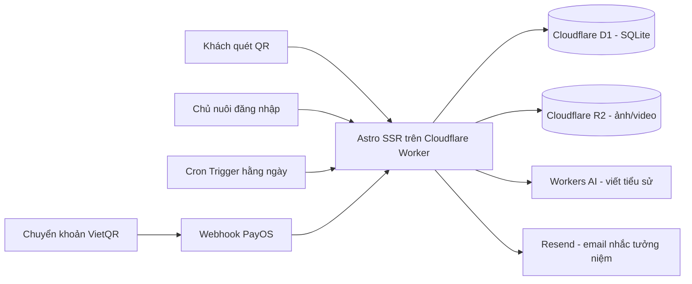

# Kế Hoạch: Nền Tảng "Ngân Hàng Kỷ Niệm Thú Cưng" (Pet Memorial)

> Tài liệu đặc tả để triển khai code. Chuyển repo Virai hiện tại thành nền tảng pet memorial đầy đủ chức năng: đăng ký tài khoản, wizard tạo trang kỷ niệm có upload ảnh + AI viết tiểu sử, trang công khai gắn mã QR với OG image chia sẻ đẹp, sổ lưu bút, gói Free/Premium thanh toán VietQR, email nhắc ngày tưởng niệm theo âm lịch, và trang quản trị.

---

## 1. Bối cảnh và quyết định đã chốt

- Repo hiện tại (`/Users/vutan/Virai website`) là landing page tĩnh của công ty Virai: **Astro 6 + Tailwind CSS 4**, deploy **Cloudflare Workers** qua Wrangler (`wrangler.jsonc`, adapter `@astrojs/cloudflare` trong `astro.config.mjs`).
- Trang giới thiệu Virai cũ sẽ được **thay thế hoàn toàn** (code cũ vẫn còn trong git history, không cần giữ lại trang nào).
- **Tên miền `virai.com.vn` dùng lại** — Worker giữ nguyên, chỉ đổi nội dung. Sau này gắn thêm domain mới (ví dụ tên thương hiệu riêng cho pet memorial) không cần sửa code.
- Phạm vi: **app đầy đủ** — khách tự đăng ký, tự tạo trang kỷ niệm (có wizard hỗ trợ + AI viết giúp), thanh toán online kiểu Việt Nam (chuyển khoản VietQR), phân biệt gói Free/Premium.
- Ngôn ngữ UI: **tiếng Việt** (ưu tiên), có thể thêm EN sau.

## 2. Kiến trúc kỹ thuật

Tận dụng tối đa hệ sinh thái Cloudflare (chi phí ~0đ ở quy mô đầu):



### Các lựa chọn công nghệ

| Thành phần | Công nghệ | Ghi chú |
|---|---|---|
| Framework | Astro 6, chuyển sang SSR (`output: 'server'`) | Adapter Cloudflare đã có sẵn |
| CSS | Tailwind CSS 4 | Đã có sẵn trong repo |
| Database | Cloudflare D1 (SQLite) + Drizzle ORM | Binding trong `wrangler.jsonc` |
| Lưu ảnh | Cloudflare R2 | Upload qua API route, nén/resize phía client trước khi upload |
| Auth | Email + mật khẩu tự xây | Session cookie lưu D1, hash mật khẩu bằng Web Crypto PBKDF2. Google OAuth để sau |
| AI viết tiểu sử | Cloudflare Workers AI | Free tier đủ dùng, binding `AI` trong wrangler |
| QR code | Thư viện `qrcode`, sinh server-side | Mỗi trang có slug dạng `virai.com.vn/be/[slug]` |
| OG image | Sinh ảnh card chia sẻ tự động (ví dụ `satori`/`workers-og` hoặc canvas) | Ảnh bé + tên + ngày sinh/ngày mất |
| Âm lịch | Thư viện chuyển đổi âm-dương lịch (ví dụ `lunar-date-vn` hoặc tương đương) | Hiển thị ngày âm, tính 49 ngày, ngày giỗ |
| Email | Resend (free 3.000 email/tháng) | Cron Trigger của Worker chạy mỗi ngày |
| Thanh toán | **PayOS** (VietQR + webhook) | Đã chốt PayOS: gói miễn phí không giới hạn cho cá nhân/HKD (từ 01/2026), có API tạo link thanh toán + SDK Node + webhook. Không dùng Stripe. Có xác nhận tay dự phòng |

### Schema database (D1)

Các bảng chính:

- `users` — id, email, password_hash, name, plan (free/premium theo từng memorial), role (user/admin), created_at
- `sessions` — id, user_id, expires_at
- `memorials` — id, user_id, slug (unique), pet_name, species, breed, birth_date, death_date, death_date_lunar (tự tính), bio (text dài), theme, cover_photo_id, is_premium, is_published, visit_count, candle_count, flower_count, created_at
- `photos` — id, memorial_id, r2_key, caption, sort_order
- `guestbook_entries` — id, memorial_id, author_name, message, status (pending/approved/rejected), created_at
- `orders` — id, user_id, memorial_id, type (premium/physical_combo), amount, payment_code (nội dung CK duy nhất), status (pending/paid/shipped/done), shipping_info (JSON, cho đơn vật lý), created_at, paid_at
- `reminders` — id, memorial_id, type (49_ngay/gio_hang_nam), next_date, enabled

## 3. Mô hình thu tiền

- **Free**: 1 trang kỷ niệm, tối đa 10 ảnh, 1 theme cơ bản, có dòng "Tạo bởi..." ở footer, sổ lưu bút giới hạn.
- **Premium — 249.000đ/bé, trả 1 lần, trọn đời**: không giới hạn ảnh + video, tất cả theme, email nhắc ngày tưởng niệm (kể cả âm lịch), ẩn logo, tải file QR chất lượng cao để tự in.
- **Combo Vật Lý — từ 499.000đ**: Premium + thẻ kim loại/gỗ khắc QR ship tận nơi (đặt qua form đơn hàng, chủ dự án xử lý in ấn thủ công với xưởng — chưa cần tích hợp API vận chuyển).

### Luồng thanh toán (phù hợp Việt Nam)

1. Khách bấm nâng cấp → tạo link/mã thanh toán qua **API PayOS** (VietQR) kèm mã đơn duy nhất (payment_code).
2. **Tự động xác nhận** qua webhook PayOS: webhook đối chiếu payment_code + số tiền → đơn tự chuyển "Đã thanh toán", memorial lên Premium ngay.
3. **Dự phòng**: trang admin cho phép xác nhận thanh toán tay nếu webhook lỗi/thiếu.

> Đã chốt dùng **PayOS** (payos.vn): gói miễn phí không giới hạn giao dịch cho cá nhân/hộ kinh doanh, có SDK Node chính thức. Lưu ý: gói miễn phí không giới hạn chạy qua hạ tầng KienlongBank, có thể cần mở tài khoản nhận tiền tại KienlongBank (mở online miễn phí). Thiết kế webhook viết tách lớp để sau này đổi nhà cung cấp không tốn công.

## 4. Các trang chính

| Route | Mô tả |
|---|---|
| `/` | Landing page mới: tông cảm xúc, ấm áp, màu nhẹ nhàng; giới thiệu dịch vụ + bảng giá + 2-3 trang demo |
| `/dang-ky`, `/dang-nhap` | Đăng ký / đăng nhập |
| `/tai-khoan` | Dashboard: danh sách bé, tạo/sửa trang, trạng thái gói, đơn hàng |
| `/tai-khoan/tao-trang` | **Wizard tạo trang nhiều bước**: thông tin bé → ngày sinh/ngày mất (hiển thị kèm ngày âm) → upload ảnh → viết câu chuyện (gợi ý câu hỏi dẫn dắt: "Bé thích ăn gì?", "Kỷ niệm đáng nhớ nhất?"... + nút **"Nhờ AI viết giúp"** biến gợi ý thành câu chuyện hoàn chỉnh qua Workers AI) → chọn theme → xem trước → xuất bản |
| `/be/[slug]` | Trang kỷ niệm công khai: ảnh bìa, slideshow, tiểu sử, timeline, sổ lưu bút (khách viết, chủ duyệt), thắp nến ảo + thả hoa + bộ đếm lượt ghé thăm; **OG image tự động** khi chia sẻ Facebook/Zalo |
| `/be/[slug]/og.png` | Endpoint sinh OG image (ảnh bé + tên + ngày sinh/ngày mất) |
| `/bang-gia` | Bảng giá + luồng thanh toán VietQR |
| `/admin` | Quản lý user, xác nhận thanh toán tay, duyệt lưu bút, quản lý đơn thẻ QR vật lý |
| `/api/webhook/payment` | Webhook nhận thông báo thanh toán từ PayOS |

## 5. Giai đoạn triển khai (thứ tự code)

### Giai đoạn 1 — Nền móng
1. Dọn site marketing cũ (xóa pages/components/data cũ), chuyển Astro sang SSR mode.
2. Cấu hình D1 + R2 + Workers AI binding trong `wrangler.jsonc`; tạo schema Drizzle + migrations.
3. Xây auth: đăng ký, đăng nhập, đăng xuất, session cookie, middleware bảo vệ route.
4. Landing page mới (tông ấm áp, có bảng giá, demo).

### Giai đoạn 2 — Lõi sản phẩm
5. Wizard tạo trang kỷ niệm nhiều bước, kèm nút "Nhờ AI viết giúp" (Workers AI).
6. Upload ảnh lên R2: nén phía client, giới hạn 10 ảnh cho Free.
7. Trang kỷ niệm công khai `/be/[slug]` với 2-3 theme + sinh mã QR tải về.
8. OG image tự động cho mỗi trang kỷ niệm.

### Giai đoạn 3 — Doanh thu
9. Sổ lưu bút có duyệt + thắp nến ảo + thả hoa + bộ đếm lượt ghé thăm.
10. Bảng giá, luồng thanh toán PayOS (VietQR) + webhook + xác nhận tay; khóa/mở tính năng theo gói.
11. Form đặt combo thẻ QR vật lý (thu thập địa chỉ ship) + quản lý trạng thái đơn.

### Giai đoạn 4 — Giữ chân + vận hành
12. Email nhắc ngày tưởng niệm qua Resend + Cron Trigger, **hỗ trợ âm lịch**: nhắc cúng 49 ngày và ngày giỗ hằng năm theo lịch âm.
13. Trang admin: user, thanh toán, duyệt lưu bút, đơn vật lý.

### Sau MVP (chưa làm đợt này)
- Video tưởng niệm tự động hằng năm.
- Google OAuth.
- "Sổ Ký Ức Sống" cho bé còn sống (đổi giao diện sang tưởng niệm khi bé mất).
- Vườn tưởng niệm chung (trang cộng đồng, chủ nuôi opt-in).
- Thêm bản tiếng Anh.

## 6. Lý do các tính năng thu hút người dùng

- **OG image đẹp**: người nuôi thú cưng VN chia sẻ nhiều trên Facebook — mỗi lượt chia sẻ trang kỷ niệm là một quảng cáo miễn phí. Đây là động cơ lan truyền chính.
- **Âm lịch (49 ngày, ngày giỗ)**: nét văn hóa Việt mà mọi sản phẩm nước ngoài không có — điểm khác biệt lớn nhất.
- **AI viết tiểu sử**: giúp khách vượt qua rào cản "không biết viết gì", đồng thời là điểm nhấn truyền thông (hợp thương hiệu AI của Virai).
- **Thắp nến / thả hoa / bộ đếm ghé thăm**: làm trang "sống", chủ nuôi có lý do quay lại thường xuyên.
- Free tier là động cơ tăng trưởng: ai cũng tạo được trang miễn phí → chia sẻ → kéo người mới.

## 7. Việc chủ dự án cần làm ngoài code

- [ ] Tạo tài khoản **PayOS** (payos.vn, miễn phí, cần CCCD) và liên kết tài khoản ngân hàng nhận tiền; lấy Client ID / API Key / Checksum Key. Cân nhắc mở tài khoản KienlongBank online để hưởng gói miễn phí không giới hạn.
- [ ] Tạo tài khoản **Resend** + xác thực domain `virai.com.vn` để gửi email.
- [ ] Quyết định giá cuối cùng cho các gói (hiện đề xuất 249k Premium / 499k Combo).
- [ ] Tìm xưởng in/khắc thẻ QR kim loại hoặc gỗ (Shopee/xưởng nhỏ) cho combo vật lý.
- [ ] Chuẩn bị 2-3 bộ ảnh + câu chuyện demo để tạo trang mẫu trên landing page.
- [ ] (Sau này) Liên hệ dịch vụ hỏa táng thú cưng, phòng khám thú y để hợp tác hoa hồng giới thiệu.

## 8. Biến môi trường / secrets cần thiết

```
# .dev.vars (local) / wrangler secrets (production)
SESSION_SECRET=          # ký session cookie (sinh bằng: openssl rand -base64 32)
RESEND_API_KEY=          # gửi email
PAYOS_CLIENT_ID=         # lấy từ dashboard PayOS
PAYOS_API_KEY=           # lấy từ dashboard PayOS
PAYOS_CHECKSUM_KEY=      # xác thực webhook PayOS
ADMIN_EMAIL=             # email tài khoản admin đầu tiên
```

Bindings trong `wrangler.jsonc`: `DB` (D1), `BUCKET` (R2), `AI` (Workers AI), cron trigger `0 1 * * *` (8h sáng VN).
